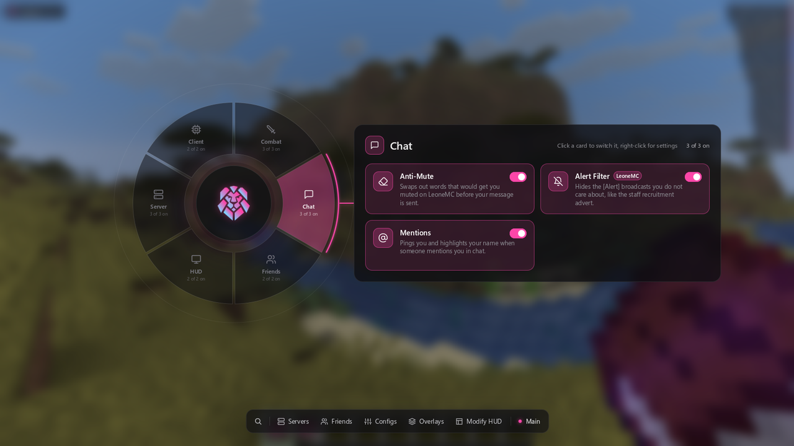
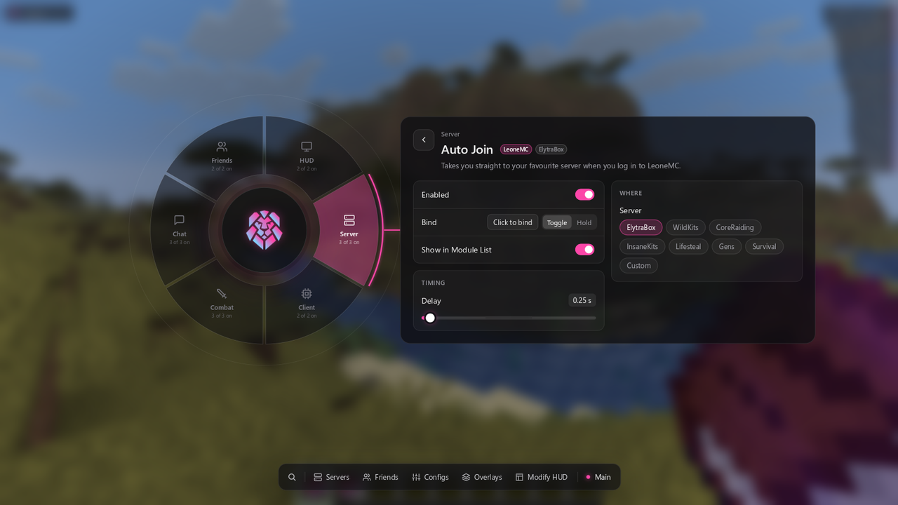
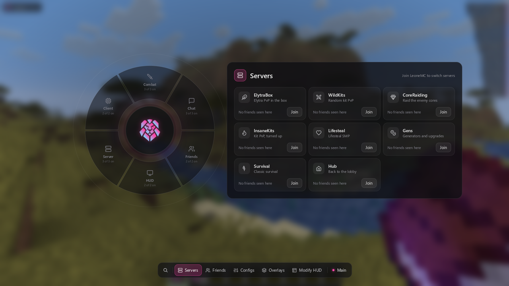
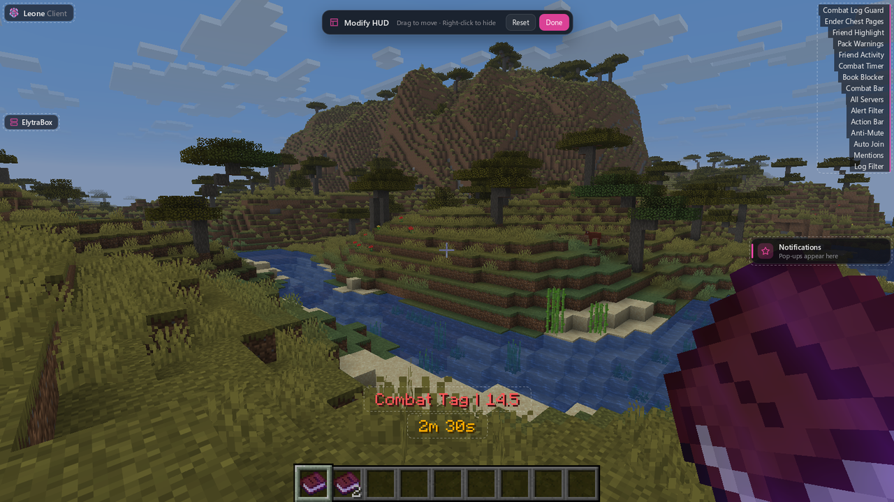

<p align="center">
  
</p>

<h1 align="center">Leone Client</h1>

<p align="center">The client mod for <a href="https://leonemc.net">LeoneMC</a>, for Fabric on Minecraft 26.2.</p>

<p align="center"></p>

Press **Right Shift** in game to open the menu. Each segment of the wheel is a category of modules, and the dock along the bottom holds search, LeoneMC's servers, your LeoneMC friends, config profiles and the HUD.

## Modules

| Category | Module | What it does |
|---|---|---|
| Combat | Combat Timer | Shows your combat tag countdown as a status effect, next to your other effects. Can chime when the tag runs out. |
| | Combat Bar | Takes the combat tag line out of the action bar and puts it on its own bar, so the two stop replacing each other. It can also be merged onto one line. |
| | Combat Log Guard | Asks for confirmation before you disconnect from the pause menu while combat tagged. |
| Chat | Anti-Mute | Replaces words that LeoneMC's filter mutes for before your message is sent, in chat and in private messages. Groups: discrimination, death wishes, swears and advertisements. |
| | Alert Filter | Hides the kinds of `[Alert]` broadcast you choose: staff recruitment (hidden by default), purchases, events, streams, tips and others. Proxy restart warnings are never hidden. |
| | Mentions | Plays a ping and highlights your name when someone mentions you. Extra keywords can be added. |
| Friends | Friend Highlight | Makes your LeoneMC friends' names stand out in chat, with their status on hover. |
| | Friend Activity | Turns `Friends \| X has joined the server Y.` into a short clickable line, a pop-up, or nothing, and can limit it to your own server. |
| HUD | Action Bar | Draws the action bar wherever you place it in Modify HUD, with optional backdrop, shadow and fade. |
| | Pack Warnings | Hides LeoneMC's resource pack titles and reminders. |
| Server | Auto Join | Sends you to ElytraBox, WildKits, CoreRaiding, InsaneKits, Lifesteal, Gens, Survival or any server you type when you log in. |
| | Book Blocker | Stops the server opening books on you, while still letting you read your own. |
| | Ender Chest Pages | Adds `/ec <page>` and `/enderchest <page>` to jump straight to an ender chest page. |
| Client | Interface | Accent colour (Leone Pink, Leone Blue, Purple, Royal Blue or Emerald), font, sounds and blur. |
| | All Servers | Runs the LeoneMC-only modules everywhere, including singleplayer, which is handy for trying them out. |
| | Log Filter | Keeps the thousands of harmless warnings LeoneMC causes out of your game log. |

Left-click a card to switch a module on or off, and right-click it (or use the gear) for its settings. Every setting explains itself when you hover it. Any module can be given a key, either to toggle it or to keep it on while held.

<p align="center"></p>

## The dock

- **Search** finds modules by name, category or description. Typing anywhere in the menu starts a search.
- **Servers** switches LeoneMC server in one click and shows which of your friends were last seen on each.
- **Friends** shows your friends list from your profile on [leonemc.net](https://leonemc.net), online friends first, with their heads, rank colours and the server they are on. You can view another player's friends with Change account, open profiles in your browser, and message online friends.
- **Configs** saves your setup as named profiles. The active profile saves automatically.
- **Overlays** turns HUD elements on and off: Watermark, Module List, Action Bar, Combat Bar, Notifications, Server, FPS, Ping, Coordinates, Speed, CPS and Keystrokes.
- **Modify HUD** lets you drag overlays anywhere. They snap to the edges and centre lines, and right-clicking one hides it.

<p align="center"></p>
<p align="center"></p>

## Installing

1. Install [Fabric Loader](https://fabricmc.net/use/) for Minecraft 26.2, with [Fabric API](https://modrinth.com/mod/fabric-api).
2. Put `leoneclient-<version>.jar` in your `mods` folder.
3. [Mod Menu](https://modrinth.com/mod/modmenu) is optional; with it, the config button opens the Leone Client menu.

Settings are kept in `config/leoneclient/`. Settings from the previous version of Leone Client (`config/leoneclient.json`) are imported the first time this version runs.

## Building

Requires JDK 25.

```bash
./gradlew build
```

The jar is written to `build/libs/`. `gradle.properties` points Gradle at the Windows certificate store so downloads work behind antivirus HTTPS inspection; remove those two options on macOS or Linux.

`./gradlew runClient` starts the game and joins the singleplayer world "Leone Test". `./gradlew runAutotest` uses its own `run-autotest/` folder: it creates that world, walks through the menu, sends LeoneMC-style messages to every feature, saves screenshots to `run-autotest/leone-shots/` and then quits.

## Notes

- The menu uses Segoe UI on Windows and falls back to the Minecraft font elsewhere (or when Interface > Font is set to Minecraft).
- The friends list and heads come from leonemc.net and mc-heads.net. Profile pages count views, so the list is fetched when you log in to LeoneMC or open the Friends page, at most every 90 seconds, and is cached on disk.
- Icons are from [Lucide](https://lucide.dev) (ISC licence).

Copyright (c) 2025-2026 Alfxyz. All rights reserved.
